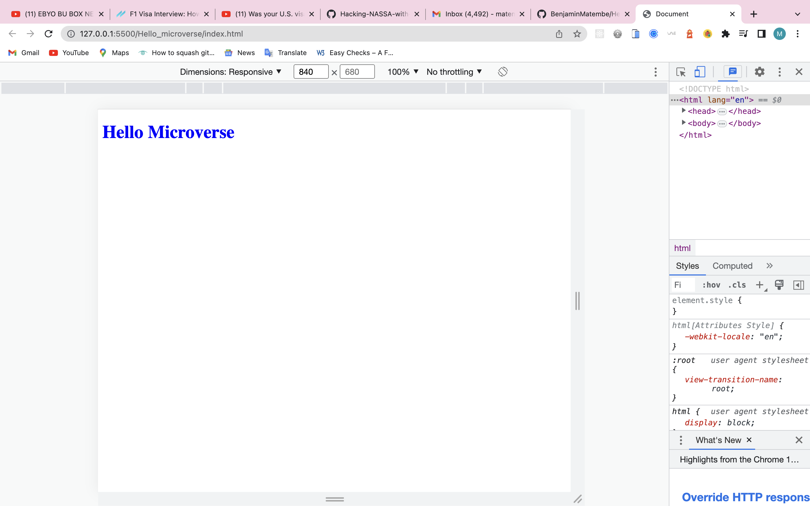

 
 <h3><b>Hello-Microverse</b></h3>

  

 My first microverse project to show the abilities of the tools and best practices learned.

# 📖 Hello_Microverse 

**Hello_Microverse** is a Setup of the project repository

## 🛠 Built With 
  
  <ul>
    <li><a href="https://www.w3schools.com/html/">HTML</a></li>
    <li><a href="https://www.w3schools.com/css/">CSS</a></li>
  </ul>

## 🚀 Live Demo 
<ul>
    <li><a href="http://127.0.0.1:5500/Hello_microverse/index.html">Live Demo</a></li>
</ul>

## 💻 Getting Started 

To get a local copy up and running, follow these steps.

Clone the code from project using terminal into your local machine and then open with live server on the index.html

### Setup

>Clone this repository to your desired folder using:

 <h1>Setup SSH-key and use this command</h1>
 git clone git@github.com:BenjaminMatembe/Hello_microverse.git

 <h1>Using HTTPS</h1>

 git clone https://github.com/BenjaminMatembe/Hello_microverse.git

## 👥 Authors 

👤 **Benjamin Matembe**

- GitHub: [@githubhandle](https://github.com/BenjaminMatembe)
- LinkedIn: [@linkedIn](https://www.linkedin.com/in/matembe-benjamin-b7274122a/)
- Twitter: [@githubhandle](https://twitter.com/Glenmata2)

## 🤝 Contributing 

Contributions, issues, and feature requests are welcome on my project!

Feel free to check the [issues page](../../issues/).

## ⭐️ Show your support 

If you like this project you can give a ⭐️.

## 🙏 Acknowledgments 

I would like to thank my coding partners for the help rendered when doing this project.

## 📝 License 

This project is [MIT](https://github.com/BenjaminMatembe/Hello_microverse/blob/master/MIT.md) licensed.
